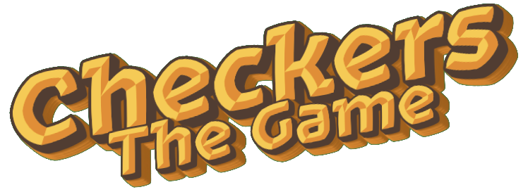
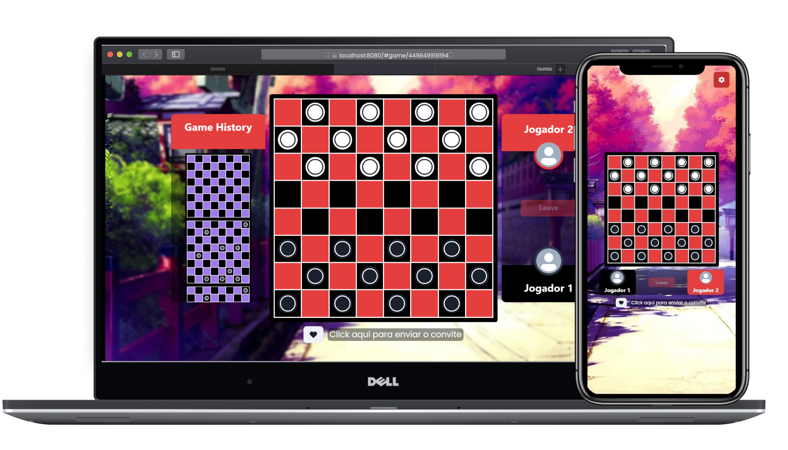
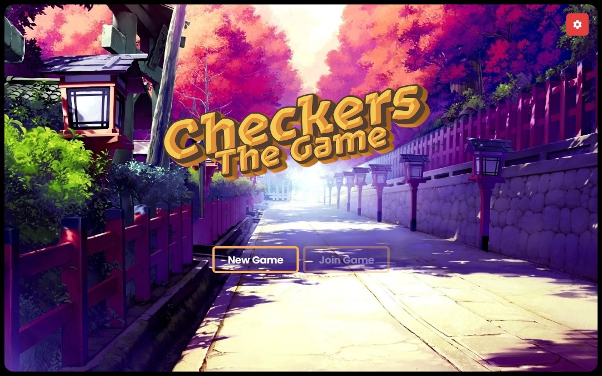
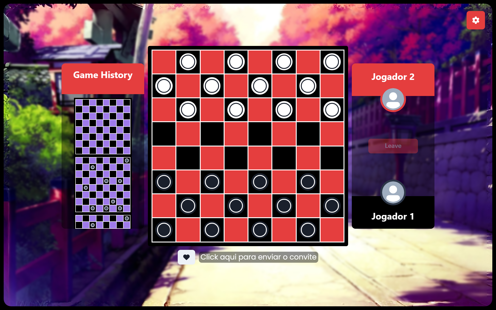
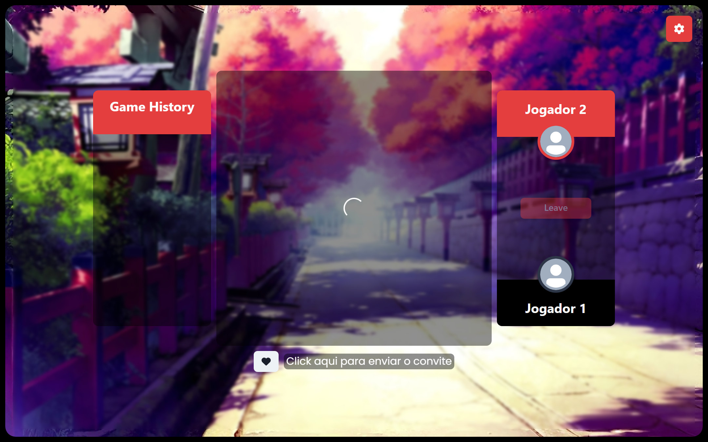
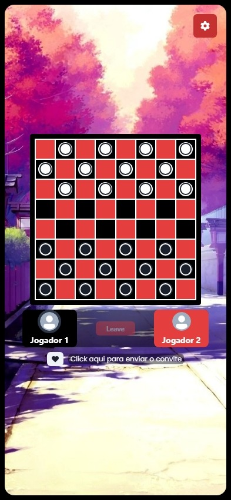

  

    
  

	<h2>Jogo de damas</h2>
	
Um jogo de damas simples usando React e Typescript.  Este jogo não está completo, pois falta a finalização de algumas funcionalidades.

## Projeto
Checkers é um jogo de damas feito por mim a um tempo atras (alguns meses) para o aprimorar o conhecimento de algumas bibliotecas usadas no frontend **React** como o **Zustand, React Router Dom (v6), Chakra UI e Vite**.

  

Este projeto não foi finalizado pois eu havia alcançado o meu objetivo inicial, treinar logica de programação e bibliotecas React. Dito isso, não pretendo concluir ou atualizar este projeto.

#### Regras basicas do jogo

Foi implementada a versão de 64 casas do jogo (conhecida por dama brasileira), onde o jogador que coletar todas as peças ou impossibilitar o oponente de jogar ganha. Peças que conseguirem invadir o tabuleiro inimigo viram damas, assim como as regras basicas do jogo.

#### Algumas funcionalidades pensadas e parcialmente implementadas

Eu fiquei animado quando esta desenvolvendo e tive algumas ideias que achei que seria legal implementar, porém não implementei tudo ou implementei parcialmente.
- **Animações na gameplay:** Comecei implementando algumas animações simples com o framer-motion como animações ao mover peças, ganhar o jogo ou fazer uma grande jogada 🔥
- **Responsividade no Game**: A tela do jogo está responsiva, porém precisa dar umas polidas e algumas escolhas que melhorem a UX.
- **Historico de Partidas**: Pensei em adicionar histórico de partidas, adicionei parcialmente. A minha ideia era um replay da partida, podendo pausar, acelerar entre outras coisas (como se fosse um player). Por enquanto apenas salva o histórico no final da partida, e execução do replay sem pausas.
- **Modo online**: Que graça tem jogar localmente não é mesmo? Por isso pensei em adicionar o modo online, porém por exigir alguns requisitos como um servidor com websocket, acadei desistindo da ideia por hora.

#### Algumas Screenshots

  

  

  

  

#### Uso das bibliotecas
Utilizei o Chakra UI para criar as interfaces do jogo. Gosto da abordagem declarativa que o Chakra UI oferece para a construção de componentes (de forma declarativa), além da conveniência de ter uma variedade de componentes prontos a nossa disposição.

No caso do Zustand, optei por uma abordagem "try hard", priorizando o desempenho. Armazenei todo o estado do jogo em um store do Zustand. A vantagem de usar o Zustand é o maior controle que ele proporciona sobre o estado e as atualizações de renderização na tela. Consegui minimizar ao máximo as renderizações, por exemplo, ao mover uma peça, apenas o slot da peça é atualizado, em vez de renderizar todo o tabuleiro ou a tela inteira.

Quanto ao React Router Dom, embora seja uma biblioteca com bastante tempo de existência, essa versão específica introduziu várias mudanças significativas. Decidi usar como parte do meu processo de aprendizado devido a essas alterações